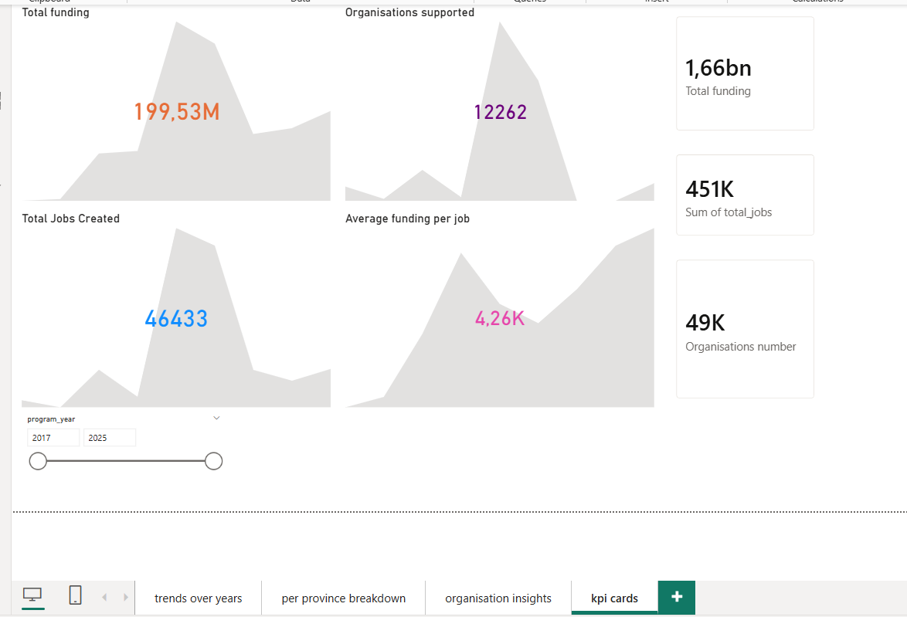
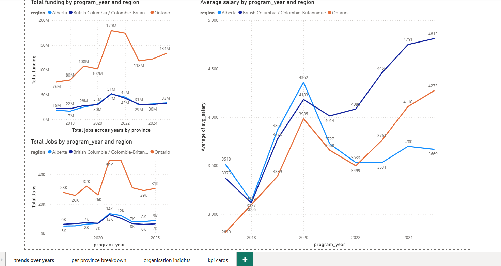
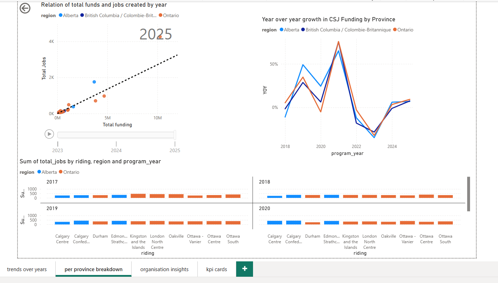
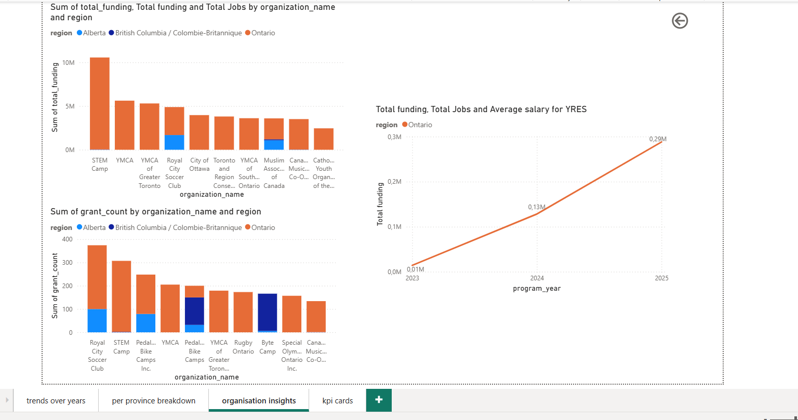

# Canada Summer Jobs Data Pipeline

Built for **YRES (York Region Educational Services)** to transform raw federal grant data into analysis-ready datasets for Power BI reporting.

The [Canada Summer Jobs (CSJ)](https://www.canada.ca/en/employment-social-development/services/funding/canada-summer-jobs.html) program is the Government of Canada's largest youth employment initiative, funding tens of thousands of summer positions annually through grants to employers across the country. This pipeline processes **137,000+ grant records** spanning 2017--2025 across Alberta, British Columbia, and Ontario.

## What the Pipeline Does

Takes a messy Google Sheet with bilingual column headers, duplicate-looking rows (separate grants to the same org), and inconsistent data -- and turns it into clean, aggregated Delta tables ready for dashboards:

- **How much funding did each organization receive per year?**
- **Which ridings created the most summer jobs?**
- **What's the average salary per job across provinces and years?**

## Architecture

```
Google Sheets (137k rows, bilingual headers)
     |
     v
[Airflow DAG - Docker]
     |
     |-- 1. extract_and_load_bronze    Airflow extracts from Sheets, writes
     |                                 to Databricks via SQL Statement API
     |-- 2. silver_cleaning            Databricks notebook: rename, type-cast,
     |                                 validate, flag data quality issues
     |-- 3. gold_aggregation           Databricks notebook: aggregate per
     |                                 org/riding/year for BI consumption
     v
Delta Tables on Databricks  --->  Power BI
```

**Why this architecture?**

- **Airflow** handles extraction and orchestration because Google Sheets credentials stay local -- no secrets uploaded to Databricks. Airflow also gives us retries, dependency management, and email alerting out of the box.
- **Databricks** handles the heavy transformations via PySpark. Serverless compute processes 137k rows through cleaning and aggregation in under a minute.
- **Medallion architecture** (bronze/silver/gold) keeps raw data intact and transformations auditable. If a data quality rule changes, we re-run silver and gold without re-extracting from Sheets.

## Medallion Layers

### Bronze (`csj_bronze.raw_funding`)
Raw data exactly as it appears in Google Sheets. Bilingual column headers preserved (`Program Year / Annee du programme`), all values stored as strings, no transformations. An `_ingestion_timestamp` column tracks when data was loaded.

### Silver (`csj_silver.clean_funding`)
Cleaned and validated:
- Bilingual columns renamed to English snake_case (`program_year`, `region`, `riding`, `organization_name`, `amount_paid`, `jobs_created`)
- Types cast: year to integer, funding to double, jobs to integer
- `avg_salary` computed per row (null when jobs_created is 0)
- `row_id` assigned -- the source data has no grant ID, so identical-looking rows are treated as separate grants
- Data quality flags (`_dq_flags` array): `null_year`, `invalid_funding`, `zero_funding_with_jobs`, `salary_outlier` (>$50k). Rows are flagged, not deleted -- downstream layers decide what to include

### Gold (`csj_gold.org_funding_summary`)
Aggregated per organization per riding per year. Only clean rows (no DQ flags) included:
- `total_funding` -- sum of all grants to that org in that riding/year
- `total_jobs` -- total summer positions created
- `grant_count` -- how many separate grants were combined
- `avg_salary` -- total_funding / total_jobs

This is the table Power BI connects to. 135,744 rows across 3 provinces, 9 years.

## Power BI Dashboard

The gold layer feeds a four-page Power BI report:

### KPI Summary


All-time program totals alongside per-year sparklines: **$1.66B** total funding across the program's lifetime, supporting **49K** organizations and creating **451K** summer jobs. The sparklines with year slicer (2017--2025) let users drill into any period -- the 2025 snapshot shows $199.5M funding, 12,262 organizations, 46,433 jobs, and $4,260 average funding per position.

### Trends Over Years


Funding and job creation trends by province. Ontario dominates in absolute funding (peaking at $179M in 2021), while average salary per job has been steadily rising across all provinces -- from ~$2,900 in 2017 to ~$4,800 in 2025, reflecting minimum wage increases and program adjustments.

### Province Breakdown


Animated scatter plot showing the relationship between total funding and jobs created per riding, with a year-over-year growth comparison. The strong linear correlation confirms funding scales proportionally with job creation. YOY growth shows a sharp spike in 2021-2022 (post-COVID recovery funding) followed by normalization.

### Organization Insights


Top-funded organizations across provinces -- STEM Camp and YMCA chapters lead in total funding. Grant count analysis reveals repeat recipients like Royal City Soccer Club (375+ grants) and STEM Camp (300+). Includes a focused view on YRES funding growth: from $10K in 2023 to $290K in 2025.

## Key Technical Decisions

**SQL Statement API instead of DBFS upload.** Originally planned to upload Parquet files to DBFS, but Databricks disabled public DBFS root access. Switched to writing data directly via the SQL Statement API (`/api/2.0/sql/statements`), inserting 2,000 rows per batch. This actually simplified the architecture -- no intermediate files.

**Delta column mapping for bilingual headers.** The source data has column names with spaces, accents, and special characters (`Region / Region`, `Montant paye`). Delta Lake requires column mapping mode (`delta.columnMapping.mode = 'name'`) to handle these. Discovered this after the first INSERT failed.

**Soft DQ flags instead of hard deletes.** Flagging problematic rows with an array column (`_dq_flags`) instead of dropping them means silver preserves all data. Gold filters to clean rows only. If stakeholders later want to include flagged rows or change thresholds, it's a one-line filter change.

**No deduplication.** Identical-looking rows (same org, same riding, same year, same amount) are separate grants -- the source data has no unique identifier. We assign `row_id` via `monotonically_increasing_id()` and preserve every row.

**Serverless compute on Free Edition.** Databricks Free Edition only supports serverless -- no custom clusters. The pipeline submits notebook runs without specifying cluster configuration, letting Databricks handle compute allocation.

**Backslash and apostrophe escaping in SQL inserts.** Organization names like `Rondeau Yacht Club \` and `Pardo's Berrie Farm` broke SQL parsing. Both backslashes and single quotes are escaped before building INSERT statements.

## Project Structure

```
csj-pipeline/
  dags/
    csj_pipeline_dag.py            # Airflow DAG: extraction + orchestration
  notebooks/
    01_bronze_ingestion.py         # Bronze validation (manual inspection only)
    02_silver_cleaning.py          # Silver: clean, type-cast, validate, flag
    03_gold_aggregation.py         # Gold: aggregate per org/riding/year
  tests/
    test_pipeline_logic.py         # Bronze/silver/gold data logic (22 tests)
    test_dag.py                    # DAG structure validation (7 tests)
    test_email.py                  # SMTP alerting (3 tests)
    test_connections.py            # Databricks + Google Sheets connectivity
  docker-compose.yaml
  Dockerfile
  requirements.txt
  .env                             # Credentials (gitignored)
  google-credentials.json          # Google service account key (gitignored)
```

## Setup

### 1. Environment variables

Create a `.env` file in the project root:

```env
DATABRICKS_HOST=https://<workspace>.cloud.databricks.com
DATABRICKS_TOKEN=<personal-access-token>
DATABRICKS_SQL_WAREHOUSE_ID=<sql-warehouse-id>
GOOGLE_SHEET_ID=<google-sheet-id>
SMTP_USER=<gmail-address>
SMTP_PASSWORD=<gmail-app-password>
ALERT_EMAIL=<failure-alert-recipient>
```

### 2. Google credentials

Place your Google Cloud service account JSON key as `google-credentials.json` in the project root. The service account needs read access to the source spreadsheet.

### 3. Databricks notebooks

Import notebooks to Databricks via the workspace UI or API. They must exist as notebook objects (not raw files) at the path configured in the DAG. After pushing to GitHub, pull from Databricks Repos or re-import.

### 4. Build and run

```bash
docker compose build
docker compose up airflow-init
docker compose up -d
```

Airflow UI: http://localhost:8081 (admin / admin)

Trigger the pipeline:

```bash
docker compose exec airflow-webserver airflow dags trigger csj_pipeline
```

Monitor task status:

```bash
docker compose exec airflow-webserver airflow tasks states-for-dag-run csj_pipeline <run_id>
```

## Testing

Tests run locally with pandas -- no Airflow or Databricks needed:

```bash
source .venv/bin/activate
python -m pytest tests/ -v                          # All tests
python -m pytest tests/test_pipeline_logic.py -v    # Data logic (22 tests)
python -m pytest tests/test_dag.py -v               # DAG structure (7 tests)
python -m pytest tests/test_email.py -v             # SMTP alerting (3 tests)
python -m pytest tests/test_connections.py -v       # Connectivity checks
```

The pipeline logic tests simulate all three medallion layers using pandas, validating the same transformations that PySpark runs on Databricks: row counts, type casting, data quality checks, aggregation correctness, and province/year coverage.

## Tech Stack

- **Apache Airflow 2.9** -- orchestration, retries, email alerting (Docker, LocalExecutor, PostgreSQL backend)
- **Databricks** (Free Edition) -- PySpark notebook execution on serverless compute
- **Delta Lake** -- ACID-compliant storage with column mapping for special characters
- **Python** -- gspread, google-auth, requests, pandas, pytest
- **PostgreSQL 15** -- Airflow metadata database
- **Gmail SMTP** -- failure alerting on task errors
- **Docker Compose** -- local development environment
